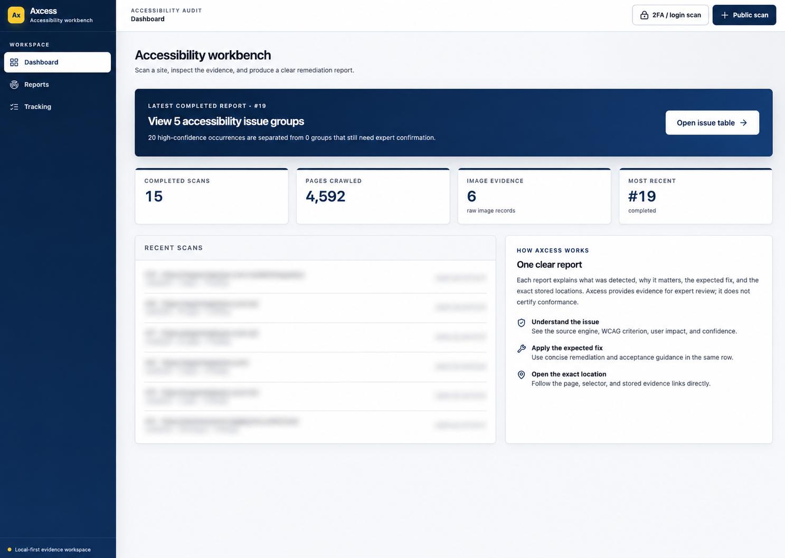

<div align="center">

# Axcess

**A local-first accessibility evidence workbench for expert web audits.**

Scan a public or login-protected website, watch each test run, inspect a clear
issue table, and export a defensible report with source-level evidence.

[Website](https://lsa-mis.github.io/axcess/) ·
[Desktop builds](https://github.com/lsa-mis/axcess/actions/workflows/desktop-build.yml?query=branch%3Afeature%2Felectron-desktop) ·
[Documentation](./docs/README.md) ·
[Coverage](./docs/coverage-tracker.md) ·
[Desktop guide](./docs/desktop-app.md) ·
[Hosting](./docs/hosting.md)

`WCAG 2.2 A/AA evidence` · `Local by default` · `MIT`

</div>

> [!IMPORTANT]
> Axcess produces accessibility evidence for expert review. Automated and
> AI-assisted results do not prove WCAG conformance, legal compliance, or the
> accessibility of an entire website.



## Desktop preview

The current desktop build packages the React workbench, FastAPI service,
Playwright Chromium, Siteimprove Alfa runner, Tesseract executable, and English
OCR language data into one macOS app. It does not require separate Python,
Node.js, Chromium, or Tesseract installations.

**[Open the latest Electron branch build](https://github.com/lsa-mis/axcess/actions/workflows/desktop-build.yml?query=branch%3Afeature%2Felectron-desktop)**,
then download `axcess-macos-apple-silicon` for the DMG. GitHub requires sign-in
to download workflow artifacts, and each build is retained for 14 days.

This is an ad-hoc signed development preview for Apple Silicon Macs. It is not
Apple-notarized and is not approved for institutional distribution. macOS may
require right-clicking **Axcess** and choosing **Open** on first launch. An
Intel Mac build is not included yet. Optional local AI checks still require an
explicitly configured Ollama service and downloaded models; Axcess does not
silently install or download them.

## The workflow

Axcess is organized around the way an accessibility expert works:

1. **Choose the site** — scan a public site, or open a visible browser and sign
   in to an authorized login/2FA site yourself.
2. **Set the scope** — preview the allowed URL path, page limit, crawl depth,
   rate, browser visibility, and test engines.
3. **Watch the scan** — see the current page, discovery and testing counts,
   enabled and skipped methods, recent activity, and an estimated completion
   time. Live updates do not move focus or auto-scroll the page.
4. **Read the report** — use one scan-scoped table that answers: **What is the
   issue? Why does it matter? What is the expected fix? Where exactly is it?**
5. **Open the evidence** — follow page, selector, snippet, rule, screenshot, or
   image references back to the stored scan evidence.
6. **Export and verify** — download the workbook or stakeholder report, assign
   remediation work, rescan, and compare new, resolved, and remaining barriers.

```text
site
  → scoped crawl and browser rendering
  → page controls operated to reach states a load never shows
  → independent detection layers
  → immutable scan evidence in SQLite and local blobs
  → issue grouping and expert decisions
  → issue table, workbook, report, and rescan comparison
```

## What Axcess includes

### Crawl and browser evidence

- Resumable, queue-driven crawling with exact path or whole-host scope.
- Rendered-page testing through Playwright Chromium, with an optional visible
  browser so the auditor can see which page is being tested.
- Conservative rate and worker controls, robots.txt support, redirect checks,
  and a static-only fast path when browser-dependent checks are not required.
- Scan progress that distinguishes discovered, fetched, rendered, and tested
  pages instead of presenting an unexplained percentage.
- A count of the DOM states reached by operating controls, reported alongside
  the page count rather than folded into it. A page count on its own
  understates an application whose content mostly appears after a click, and
  counting states as pages would overstate what was crawled.
- Page-scoped evidence routes that reject mismatched report and page IDs.
- One active crawl per Axcess process, matching SQLite's local single-writer
  operating model.

### Detection layers

Each result retains the layer that produced it. Axcess does not merge two
engines into a single unexplained verdict.

| Layer | What it checks | Result type | Local dependency |
| --- | --- | --- | --- |
| **axe-core** | Machine-testable DOM, ARIA, name, structure, and contrast rules on the rendered page | Deterministic rule evidence | Chromium |
| **Siteimprove Alfa** | Independent ACT-rule outcomes from its own local browser capture | `passed`, `failed`, or `cantTell`; failures and uncertainty remain attributed to Alfa | Bundled Node runner + Chromium |
| **Keyboard probe** | Bidirectional Tab and Shift+Tab exit attempts, Escape behavior, focus cycles, frames, and modal context | Conservative WCAG 2.1.2 review leads | Chromium |
| **Responsive probe** | 320 CSS-pixel reflow, resize behavior, clipping, and text-spacing overrides | Browser-observed evidence for 1.4.4, 1.4.10, and 1.4.12 | Chromium |
| **Focus probe** | Obscured focus and positive `tabindex` behavior | Browser-observed focus evidence | Chromium |
| **Image-of-text** | OCR plus vision-model assessment of meaningful text embedded in images | AI-assisted evidence for 1.4.5 | Tesseract; Ollama for VLM classification |
| **DOM State Discovery** | Operates a page's menus, dialogs, tabs, and disclosure controls, then re-runs axe on every DOM state a click reveals | Deterministic rule evidence from states a load-time pass cannot reach. `--skip-interaction` turns it off when crawl time matters more. | Chromium |
| **Semantic analyzer** | Whether contextual content such as a link purpose or heading is understandable | Local-LLM lead requiring expert confirmation | Ollama |
| **Visual probe** | Screenshot reading-order leads plus measured autoplay, audio, and moving-content behavior | Mixed AI-assisted and browser-observed evidence | Chromium; Ollama for visual judgment |

Alfa is not an axe-core wrapper. It is a separate Siteimprove engine using ACT
rules and a separate capture. Choose **axe**, **Alfa**, or **both** when starting
a scan. Running both is slower but makes corroboration and disagreement visible.

### Single-page applications and DOM states

Axcess supports client-rendered applications built with React, Vue, Angular,
Svelte, and similar frameworks. Playwright loads each page, waits for the
application to render, and then extracts links from the resulting DOM. Normal
history routes such as `/about` and hash-router routes such as `#/about` and
`#!/about` are queued as distinct pages. Ordinary in-page anchors such as
`#main-content` still deduplicate to the current page.

Route discovery is link-driven and remains inside the configured host and path
scope. Axcess does not inspect application bundles or guess private routes. A
route must appear as a rendered `<a href>` link, be linked from another
discovered page, or be supplied as the scan's starting URL. Page and depth
limits still apply, so a completed bounded scan does not necessarily represent
every route implemented by an application.

**Click through DOM states** extends that coverage beyond page loads. Enable it
under **Advanced settings** in the New Scan form; CLI scans enable it unless
`--skip-interaction` is supplied. The probe operates visible buttons, tabs,
menus, dialogs, disclosure controls, and similar elements, then re-runs
axe-core whenever the DOM changes. Findings retain the control that revealed
them, allowing Page Evidence to say, for example, **After clicking “Open
profile menu.”** The report also keeps DOM-state counts separate from page
counts.

Interaction is deliberately bounded and conservative:

- links remain the crawler's responsibility and are not clicked by the probe;
- controls with names such as sign out, delete, remove, unsubscribe, or
  deactivate are refused;
- navigations are reversed rather than followed outside the scoped crawl
  queue;
- each page is capped at 40 clicks, three samples of a repeated control shape,
  and two levels of newly revealed controls;
- dropdowns rendered by the operating system, hover-only behavior, gestures,
  closed shadow DOM, embedded cross-origin interfaces, and states without an
  observable DOM change can still require manual testing.

DOM-state results are browser-observed evidence, not proof that every possible
application state or assistive-technology interaction was tested.

### Honest WCAG coverage

The versioned WCAG 2.2 A/AA matrix contains all **55** Level A and AA success
criteria. Axcess currently contributes some evidence to **29** criteria:

- 5 are categorized as automated for defined machine-testable conditions;
- 18 are partly automated;
- 6 are AI-assisted;
- 26 remain manual-only.

Every matrix entry states what Axcess tests and what an expert must still test.
The in-app **Tracking** page and
[`docs/coverage-tracker.md`](./docs/coverage-tracker.md) read from the same
versioned source so the coverage claim cannot silently drift from the code.

## Clear results, not raw scanner output

The primary report groups repeated occurrences into actionable issue groups.
It labels both numbers—for example, **19 issue groups / 965 detected
occurrences**—instead of presenting a large raw count without context.

Each issue brings together:

- issue title, WCAG criterion and conformance level;
- detection source, method, confidence, and review state;
- affected users and why the barrier matters;
- affected page count and occurrence count;
- exact page URL, page title, selector or target, and bounded context;
- expected remediation steps and acceptance criteria;
- verification guidance and links to stored page evidence;
- expert status, rationale, and decision history.

AI-assisted results and Alfa `cantTell` outcomes are explicitly marked as
needing confirmation. Informational evidence cannot silently become a barrier.

## Reports and exports

Completed public scans can produce:

- **Excel workbook (`.xlsx`)** — the operational handoff artifact. Its sheets
  include Summary, Issues, Page Hotspots,
  Page References, Who's Affected, Coverage, Test Tracking, and Manual Evidence.
- **Stakeholder audit report (`.md`)** — evaluation context, scope, methods,
  limitations, results, recommended actions, verification, and appendices.
- **Evidence inventory (`.md`)**, **CSV**, **JSON**, and **Jira CSV** exports.
- **Rescan comparison** — new, resolved, and still-open evidence for the same
  normalized scope.

Workbook URLs, evidence references, and in-app destinations are written as
clickable hyperlinks. Issue rows include a **Source layer** field so recipients
can see whether evidence came from axe, Alfa, a browser probe, OCR/VLM, or the
semantic analyzer.

Final expert reports are gated on review readiness. Unresolved automated leads
remain visible, confirmed open barriers remain in the remediation worklist, and
an incomplete export is unmistakably labeled **DRAFT**.

## Public sites and login/2FA sites

### Local manual-login scan

The desktop and loopback web app support a practical local login flow:

1. Select **Login or 2FA website**.
2. Enter the authorized HTTPS application URL and any required sign-in origins.
3. Axcess opens a visible Chromium window.
4. Sign in directly with the website using password, passkey, push, OTP, or
   another factor. Do not enter credentials into Axcess itself.
5. Navigate to the approved post-login application page and select **I have
   signed in**.
6. Axcess verifies the page is in scope and begins the scan using that live
   in-memory browser session.

Axcess does not ask for the password or second factor. Login and identity
provider pages are not report evidence. The local session ends with the scan or
process and is not an authentication-bypass mechanism. Use only accounts and
targets for which you have explicit authorization.

### Managed protected scans

The repository also contains a stricter deployment design for sensitive U-M
targets: identity-aware proxy enforcement, a scan-bound mTLS companion,
managed-KMS envelope encryption, redaction, seven-day protected-evidence
retention, protected export controls, and fail-closed egress policy. That mode
requires institutional infrastructure and is disabled by default. The shared
`AUDIT_ACCESS_TOKEN` is not sufficient. See
[`docs/protected-scans.md`](./docs/protected-scans.md).

## Accuracy and false-positive controls

Axcess is designed to reduce false discoveries without hiding uncertainty:

- deterministic failures, behavioral observations, AI leads, and
  informational evidence use separate lanes;
- keyboard-trap detection suppresses ordinary focus wrapping, small benign
  cycles, expected modal containment, and opaque frame/shadow cases;
- source evidence is preserved instead of replacing it with generated prose;
- every actionable group can be accepted, rejected as a false positive,
  remediated, or retained as an open barrier with rationale;
- partial groups exclude terminal false-positive and remediated occurrences
  from active counts and locations while preserving their history;
- a versioned adversarial corpus enforces a **less than 5% false-discovery
  rate on that labeled corpus**.

That last gate prevents known detector regressions; it is not a claim that
every production website will be below 5%. A public real-world accuracy claim
requires a representative held-out corpus reviewed independently by at least
two accessibility experts. The validation protocol is documented in
[`tests/quality/README.md`](./tests/quality/README.md).

## Run from source

### Requirements

- macOS, Linux, or Windows (WSL is recommended for the documented `make`
  commands on Windows)
- Python 3.11 or newer
- [uv](https://docs.astral.sh/uv/)
- Node.js 22.22 or newer
- Tesseract for OCR/image-text analysis
- Ollama only when local semantic or vision-model checks are enabled

### Setup

```bash
git clone https://github.com/lsa-mis/axcess.git
cd Axcess

make setup             # Python dependencies + Playwright Chromium
make migrate           # local SQLite schema
make alfa-install      # optional Alfa engine
make frontend-build    # build the React app
make run               # http://127.0.0.1:8765/app/
```

For local AI-assisted checks:

```bash
# Start Ollama first, then fetch the configured local models.
make fetch-models
```

The same scan can be started from the CLI:

```bash
uv run audit crawl https://example.com --max-pages 50
uv run audit status
uv run audit serve
```

CLI scans operate page controls by default; the New Scan form presents this as
an unchecked Advanced Settings option. Turn the CLI probe off, or adjust what a
crawl refuses to visit:

```bash
# Load-state only: faster, and blind to anything behind a menu or dialog.
uv run audit crawl https://example.com --skip-interaction

# Never visit URLs containing a pattern, on top of the sign-out/delete
# defaults that stop an authenticated crawl ending its own session.
uv run audit crawl https://example.com --block /admin --exclude https://example.com/reports

# Drop those defaults. Safe without a session to lose; an authenticated
# scan may sign itself out.
uv run audit crawl https://example.com --allow-session-ending-urls
```

Use `uv run audit --help` and `make help` for the complete command surface.

## Desktop development and packaging

Desktop work lives on `feature/electron-desktop` and reuses the same product UI
and API rather than maintaining a second implementation.

```bash
make desktop-setup      # install desktop, backend, Alfa, and frontend dependencies
make desktop-run        # launch the development desktop app
make desktop-test       # launcher + packaged-server tests
make desktop-package    # platform-specific installer under desktop/out/
```

The Electron window uses an exact random loopback origin, Chromium sandboxing,
context isolation, disabled renderer Node integration, denied permission
requests, restricted navigation, and an integrity-checked ASAR. Scan data is
stored in the operating system's application-data directory—not in the app
bundle. Read [`docs/desktop-app.md`](./docs/desktop-app.md) for signing,
notarization, platform builds, and current release limitations.

## Local data and privacy

For a source checkout, completed scan evidence lives in:

```text
data/audit.db   SQLite source of truth
data/blobs/     content-addressed image evidence
data/logs/      local operational logs
```

Generated CSV, Markdown, JSON, Jira, and Excel files are snapshots, not the
authoritative record. Axcess has no telemetry and does not upload report data
by default. It necessarily connects to the target site being audited. Ollama
analysis is local; administrators must make an explicit product decision before
configuring any external model, webhook, or integration that transmits data.

LAN hosting must remain private or access-gated. Do not expose the crawler as
an unrestricted public service. See [`docs/hosting.md`](./docs/hosting.md).

## Architecture

```text
src/audit/
├── crawler/          URL policy, fetchers, renderer, queue orchestration
├── extractor/        image discovery, download policy, blob storage
├── analyzer/         axe, Alfa, OCR/VLM, semantic, keyboard/focus/visual probes
├── synthesizer/      grouping, priority, remediation, rescan diffs
├── protected/        authenticated-session, encryption, redaction, retention
├── exports/          workbook, report, CSV, JSON, Jira, Markdown
├── web/              FastAPI API and React frontend
├── db/               migrations, repositories, queue, status history
└── rules/            coverage and remediation rule packs

desktop/              Electron runtime, backend bundle, installers
tests/                unit, integration, UI/accessibility, quality corpus
docs/                 product, deployment, accessibility, and developer guides
```

The durable boundary is:

```text
target site
  → crawler and Playwright renderer
  → extraction, engines, and behavioral probes
  → SQLite evidence and content-addressed blobs
  → synthesis and issue grouping
  → FastAPI + React + exports
```

Read [`docs/architecture.md`](./docs/architecture.md) for the detailed data
flow and [`docs/developer-guide.md`](./docs/developer-guide.md) for extension
points.

## Development quality gates

```bash
make lint              # Ruff + frontend ESLint/accessibility rules
make typecheck         # strict mypy + TypeScript
make frontend-build    # production React build
make quality-gate      # versioned labeled-corpus precision checks
make detection-evals   # efficacy, evidence-path efficiency, and scale
make test              # complete unit, integration, and UI suite
```

See [`DETECTION_EFFICACY.md`](./DETECTION_EFFICACY.md) for metric definitions,
gates, limitations, and the dedicated CI evaluation workflow.

The UI has keyboard, screen-reader, focus, 200% zoom, 320-pixel reflow, and
axe-core regression coverage. Export tests verify scope, methods, limitations,
manual evidence, source attribution, and hyperlink behavior.

## Documentation

Start with the [documentation hub](./docs/README.md), then use the guide that
matches the task:

| Guide | Purpose |
| --- | --- |
| [User guide](./docs/user-guide.md) | start scans, read results, export, and compare |
| [Coverage tracker](./docs/coverage-tracker.md) | see exactly what is automated, assisted, or manual |
| [Architecture](./docs/architecture.md) | understand the pipeline and stored evidence |
| [Developer guide](./docs/developer-guide.md) | extend the crawler, analyzers, API, UI, or exports |
| [Desktop app](./docs/desktop-app.md) | run and package Electron builds |
| [Protected scans](./docs/protected-scans.md) | plan institutionally controlled authenticated scans |
| [Hosting](./docs/hosting.md) | operate a private LAN or Tailscale instance |
| [Accessibility](./docs/accessibility.md) | follow the UI accessibility contract |
| [Troubleshooting](./docs/troubleshooting.md) | diagnose WAF, browser, model, and crawl problems |

## License

[MIT](./LICENSE). Built for evidence-led accessibility work at the University
of Michigan. Axcess is not an official U-M conformance certification service.
