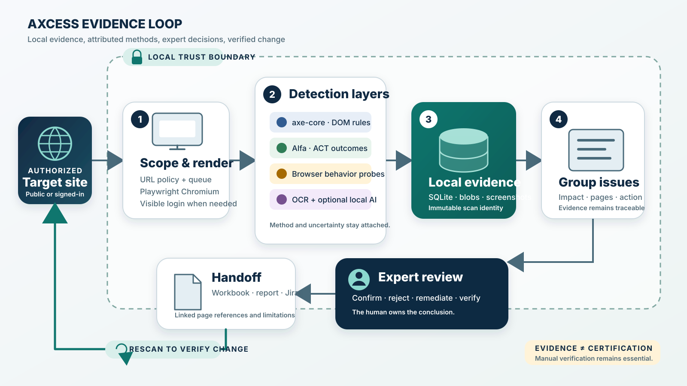

# Axcess: Evidence Before Verdicts

**A local-first accessibility evidence workbench for expert web audits** 
Project white paper · Version 1.0 · 27 August 2026 
Software baseline: Axcess `0.1.0`

> **Important:** Axcess collects and organizes accessibility evidence for
> expert review. It does not certify WCAG conformance, prove legal compliance,
> or establish that an entire website is accessible.

## Abstract

Accessibility evaluation is not a single automated test. Rule engines can
identify machine-testable failures, browsers can expose interaction and layout
behavior, local models can surface contextual review leads, and people must
still decide what the evidence means. In practice, these layers are often
split across tools, stripped of page context, or collapsed into a misleading
pass/fail score.

Axcess is being built to close that operational gap. It is a local-first
desktop and loopback web application that scopes one website, preserves the
evidence from each detection method, groups repeated occurrences into issues,
and gives an accessibility professional a traceable path from impact to page,
element, evidence, remediation, and verification. Its core proposition is
simple: **preserve evidence before producing a verdict**.

## 1. The problem we are solving

An accessibility professional needs more than a count of violations. They
need to know:

1. what created the result and how reliable that method is;
2. who may be affected and what task may be blocked;
3. which pages and elements contain the problem;
4. what evidence supports the conclusion;
5. what change is expected and how it will be verified; and
6. whether the result is new, unresolved, remediated, or a false positive.

Traditional scanner output often makes this work harder. Thousands of repeated
occurrences can obscure a small number of root problems. Deterministic findings
and uncertain machine judgments may appear equivalent. Screenshots, selectors,
page titles, and method limitations can become detached from the report. When
authenticated applications are involved, sending raw page content to a hosted
service can also create an unacceptable privacy boundary.

Axcess treats these as evidence-management problems, not merely detection
problems.

## 2. Product thesis

Axcess is organized around five commitments:

- **Local by default.** Scan data, screenshots, and content-addressed image
  blobs remain on the auditor's machine unless the operator explicitly chooses
  another controlled deployment.
- **One report, one scope.** Every page, finding, issue, decision, and evidence
  reference belongs to an exact `scan_id`. Results from separate scans are not
  mixed implicitly.
- **Methods remain attributable.** axe-core, Siteimprove Alfa, browser probes,
  OCR, and model-assisted analysis retain their own source and confidence.
- **Uncertainty remains visible.** AI-assisted results, `cantTell` outcomes,
  and behavioral leads are presented for confirmation rather than promoted to
  facts.
- **The expert controls the conclusion.** Automation proposes and organizes;
  a human accepts, rejects, remediates, documents, and verifies.

## 3. The Axcess evidence loop

**Text equivalent:** An authorized target enters a local trust boundary. Axcess
applies URL scope, renders pages in Chromium, and runs independent detection
layers. Raw results and screenshots are stored in scan-scoped SQLite records
and content-addressed blobs. Axcess groups repeated evidence into issues. An
expert reviews user impact, page references, remediation, and limitations,
then exports or assigns the work. A rescan compares new, remaining, and
resolved evidence and begins the loop again.

The completed scan—not a generated workbook, Markdown file, or rendered UI—is
the source of truth. Axcess stores the report in `data/audit.db` with supporting
files in `data/blobs/`. Exports are reproducible views of that evidence.

## 4. How the system works

### 4.1 Scope and capture

The operator supplies an authorized seed URL and chooses a path or host scope,
page limit, crawl depth, rate, browser visibility, and test methods. URL policy,
redirect checks, robots handling, and a resumable queue constrain discovery.
Playwright Chromium renders JavaScript applications and supports a visible,
manual sign-in flow for login or 2FA sites. Credentials and second factors are
entered into the target site—not into Axcess.

### 4.2 Independent evidence layers

| Layer | Evidence produced | Interpretation |
| --- | --- | --- |
| axe-core | Rendered-DOM rule violations with rule, target, and context | High-confidence deterministic evidence for the tested condition; remediation still requires verification |
| Siteimprove Alfa | Independent ACT-rule `passed`, `failed`, and `cantTell` outcomes | A second attributed engine, not an axe wrapper; uncertainty remains explicit |
| Keyboard, responsive, focus, and media probes | Observed focus movement, geometry, reflow, text-spacing, and playback behavior | Repeatable browser evidence and conservative expert-review leads |
| Image analysis | Tesseract OCR plus optional local vision-model classification and alt comparison | Evidence for images of text; model judgments require confirmation |
| Semantic and visual analysis | Bounded page context or screenshots evaluated by optional local models | Contextual leads, never autonomous conformance decisions |
| Manual evaluation | Expert outcome, rationale, page reference, and supporting evidence | The human decision layer for criteria and contexts automation cannot decide |

Axcess currently maintains an authoritative matrix for all **55 WCAG 2.2 Level
A and AA success criteria**. It contributes some evidence to **29** of them:
5 categorized as automated, 18 partly automated, and 6 AI-assisted. The other
26 remain manual-only. “Contributes evidence” does not mean that Axcess can
fully decide those 29 criteria without a person.

### 4.3 Durable, scan-scoped evidence

Raw evidence is retained before synthesis. Page records, selectors, snippets,
engine outcomes, OCR text, screenshots, and image hashes remain associated with
the scan and page that produced them. Content-addressed blobs deduplicate image
data without weakening ownership checks. The normal SQLite model is deliberately
single-host with one active writer; Axcess does not imply multi-user tenancy.

### 4.4 Issue synthesis and review

The review surface groups repeated occurrences by a stable issue identity while
showing both numbers—for example, issue groups and total occurrences. Each
actionable issue is intended to answer:

- **What is the issue?** Rule, criterion, level, source layer, and status.
- **What is the user impact?** The affected user and practical barrier.
- **Where is it?** Linked page references, URLs, titles, selectors, and bounded
  context.
- **What should change?** Remediation steps and acceptance criteria.
- **How will we know?** Verification guidance and access to stored evidence.

AI-assisted evidence and Alfa `cantTell` outcomes stay in a review-needed lane.
Informational evidence cannot silently become a confirmed barrier.

### 4.5 Handoff and rescan

The operational Excel workbook contains Summary, Issues Overview, Page Hotspots,
Page References, Who's Affected, Coverage & Method, Test Tracking, and Manual
Review Evidence. The Issues Overview sheet uses **User Impact**, and its page
references link to the corresponding workbook evidence. Separate Owner Worklist
and Decision History sheets are intentionally omitted; ownership and decisions
stay attached to the relevant issue or evidence workflow instead of becoming
disconnected ledgers.

Axcess can also produce stakeholder Markdown, evidence inventory, CSV, JSON,
and Jira CSV exports. A later scan of the same normalized scope can identify
new, still-present, and resolved evidence. This makes verification part of the
workflow rather than an afterthought.

## 5. Desktop delivery

The Electron application packages the existing React workbench and FastAPI
service rather than creating a separate product. It starts a private backend on
an available loopback port and opens the same interface in a sandboxed window.
The package includes Python, Node.js for Alfa, Playwright Chromium, Tesseract,
and English OCR data. Optional Ollama models remain separate and are never
downloaded silently.

Automated CI currently produces preview artifacts for **Windows x64** and
**Apple silicon macOS**. These builds are operating-system specific and
unsigned; Windows SmartScreen or macOS Gatekeeper may warn during installation.
Production distribution still requires platform signing, Apple notarization,
managed update and rollback procedures, and organizational security review.

Desktop evidence is stored in the operating system's application-data folder,
not inside the installed application. Closing Axcess stops the private backend,
and a second launch reuses the existing single-writer application instance.

## 6. Privacy and security boundary

Local-first operation is a product boundary, not a marketing label:

- the desktop backend binds only to loopback;
- the Electron renderer has Node integration disabled, context isolation and
  sandboxing enabled, and navigation restricted to the exact local origin;
- scan evidence does not leave the host merely because a model-assisted method
  exists;
- local Ollama is optional and must be intentionally configured; and
- scanned content is treated as untrusted evidence, not as instructions.

Axcess also documents a stricter design for institutionally managed protected
scans, including identity-aware access, a scan-bound companion, encryption,
redaction, limited retention, and fail-closed egress. That mode requires
external infrastructure and is disabled by default. A shared access token is
an ingress gate, not user identity, tenancy, or an audit log.

## 7. Accuracy without overclaiming

False positives cost expert time and weaken trust, so Axcess separates evidence
lanes and tests detector behavior against a versioned adversarial corpus. The
current quality gate targets a false-discovery rate below 5% on that labeled
corpus. This is a regression guard—not a claim that every production website
will achieve the same rate.

A defensible public accuracy claim requires a representative held-out corpus
and independent review by multiple accessibility experts. Until then, Axcess
reports method, confidence, limitations, and review status with the result.

## 8. What Axcess is—and is not

Axcess **is** a local evidence workbench for an accessibility professional, a
repeatable way to combine multiple detection layers, and a traceable bridge
from discovery to remediation verification.

Axcess **is not**:

- a legal-compliance or WCAG-certification service;
- an unrestricted public crawler;
- a replacement for assistive-technology and manual testing;
- a multi-tenant hosted audit platform; or
- an autonomous agent allowed to change findings, start scans, or contact
  external services without a separate confirmed action.

## 9. Intended direction and measures of success

The near-term direction is to make the evidence loop dependable across desktop
platforms, deepen the expert-review workflow, expand coverage only where a
method can retain honest end-to-end evidence, and validate accuracy with a
stronger independently reviewed corpus. A planned report-scoped conversation
layer may help experts ask which issues matter first or which pages are
affected, but it must remain optional, read-only by default, explicitly
provider-configured, and bound to one completed scan.

Progress should be measured by outcomes that matter to an audit team:

- time from completed scan to a prioritized, review-ready issue set;
- percentage of claims with a working page and evidence reference;
- expert agreement with deterministic and assisted findings by method;
- false-discovery rate on versioned and held-out corpora;
- successful verification of remediated issues on rescan; and
- absence of cross-scan evidence leakage or silent external data transfer.

## Conclusion

Axcess is trying to make accessibility auditing more inspectable, private, and
operationally useful. Its differentiator is not a promise that automation can
decide accessibility. It is the opposite: every useful machine result should
arrive with enough provenance, context, and limitation for a person to make a
better decision—and enough durable evidence to verify that decision later.

## Repository references

- [Product overview](../README.md)
- [System architecture](../docs/architecture.md)
- [Coverage and feature tracker](../docs/coverage-tracker.md)
- [Desktop application](../docs/desktop-app.md)
- [Protected scan design](../docs/protected-scans.md)
- [Accessibility contract for the Axcess UI](../docs/accessibility.md)
- [Detector quality protocol](../tests/quality/README.md)
